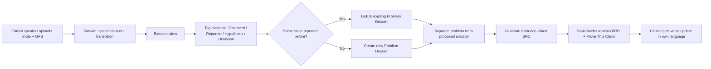
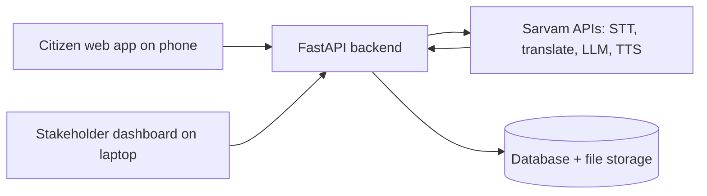

# 🇮🇳 Awaaz

### The AI Requirements Engineer for the Unheard

> **Citizens describe experiences. Awaaz turns them into evidence-backed requirements.**

**Track 4: Business Requirements Document (BRD) Generation Agent** · Problem Statement PS41 · Built with [Sarvam AI](https://www.sarvam.ai/) APIs
**HackSprint 24-Hour Hackathon** · Manipal Academy of Higher Education, Bengaluru

**Team:** The Inquisition · **Members:** Nilayansh Upadhyay, Mehul Aggarwal, Neha Kommaraju, Divyansh Sharma

> 🚧 **Status: Planning and design complete. Build in progress for the hackathon (Oct 17-18, 2026).**
> Everything under "How it works" describes the planned system. Nothing here is claimed as already implemented.

---

## The problem

> *"Every monsoon, the road outside our school disappears."*

A parent reports this in Kannada. The system receives: **"Road floods near school."**

What the institution actually needs to know:

- What is happening?
- Who is affected?
- Is it recurring?
- What evidence exists?
- What exactly needs to be investigated?

**The citizen experienced the problem. Nobody translated that experience into a requirement.**

### Why today's systems fail

| Step | What happens today |
|---|---|
| Citizen | Describes the problem in their own language |
| Portal | Asks them to pick a department and category, fill a form, upload evidence |
| System | Creates Complaint #18492 |
| 23 other citizens | Report the same flood and create 23 more complaints |
| Institution | Sees 24 tickets, when the reality is **one recurring problem** |

Existing systems capture complaints. They lose the human context, and they lose the pattern.

---

## The solution

Awaaz is an AI **requirements-engineering layer** between the people experiencing a problem and the organisations that can solve it. It is not a complaint portal and not a chatbot.

**Speak → Understand → Connect → Structure → Act**

| Citizen says | Awaaz produces |
|---|---|
| "The road floods." | Recurring waterlogging identified |
| "Children can't reach school." | Impact logged as a *reported* claim |
| "We need a new road." | Solution separated from the underlying need |
| 23 separate experiences | 1 problem dossier |
| "Trust me." | Evidence-linked claim |

### The evidence model

Awaaz does not blindly accept or invent facts. Every claim extracted from a report gets one of four statuses:

| Status | Meaning | Example |
|---|---|---|
| 🟢 **OBSERVED** | Supported by submitted evidence | Photo shows water covering the road |
| 🟡 **REPORTED** | Something the citizen says happened | "Children can't reach school during heavy rain" |
| 🔵 **HYPOTHESIS** | A possible explanation generated by AI | "Drainage capacity or road elevation may contribute" |
| ⚪ **UNKNOWN** | Not enough information | "Number of affected households: unknown" |

**Awaaz never presents an AI hypothesis as established fact.**

### Problem is separated from the proposed solution

The citizen says *"We need a new road."* Awaaz does not write "Requirement: build a new road." Instead it writes:

- **Observed problem:** recurring road inaccessibility during rainfall
- **Possible contributors (hypotheses):** drainage, road elevation, obstruction
- **Unknown:** exact engineering cause
- **Required investigation:** site-level drainage and road assessment

### Many experiences, one problem

23 experiences ≠ 23 complaints. 23 experiences → 1 systemic problem. Related reports are linked into a single **Problem Dossier** (for example, *Dossier #184: Recurring School Road Waterlogging*) with all reports and evidence attached.

### Why a BRD agent, not a complaint tool

| A complaint says | An Awaaz BRD says |
|---|---|
| "Road floods." | **Problem:** recurring road inaccessibility during rainfall |
| | **Evidence:** 23 independent reports + 14 photos |
| | **Impact:** school access disrupted (reported) |
| | **Unknown:** exact engineering cause |
| | **Requirement:** conduct drainage and site assessment |
| | **Acceptance criteria:** cause identified and intervention options listed |

### Prove This Claim

Every important claim in the BRD is traceable. If the BRD says *"23 independent reports indicate recurring waterlogging"*, a stakeholder clicks **Prove This Claim** and sees:

```
CLAIM: 23 reports indicate recurring waterlogging

SUPPORTED BY
  Report #018  GPS · Voice · 12 Aug
  Report #031  GPS · Photo · 14 Aug
  Report #044  Voice · 19 Aug
  ... 20 more
```

Instead of "trust the AI", Awaaz shows *why* the AI said it.

### Closed loop

The citizen does not disappear into a complaint graveyard. They receive an update in their own language (as voice), for example: *"Your experience has been connected to 23 related reports. A requirements brief has been generated and submitted for technical review."*

### Who it serves

Municipal bodies · NGOs · CSR teams · Ward committees · Foundations · Infrastructure teams

---

## How it works (planned flow)



**Rule:** A human reviews every BRD before it is sent to a stakeholder.

---

## Architecture and tech stack (planned)



### Built during the 24-hour hackathon (lean stack)

| Layer | Choice |
|---|---|
| Frontend | Next.js (mobile-first web app / PWA): mic, photo upload, GPS, BRD dashboard |
| Backend | FastAPI (Python) |
| Database and file storage | Supabase (Postgres + storage) |
| AI | Sarvam APIs: speech-to-text, translation, Sarvam-M LLM, text-to-speech |
| BRD export | HTML to PDF |

### Scale-up later (not part of the hackathon build)

Redis + task queue, object storage (S3/MinIO), PostGIS for geo queries, pgvector for semantic similarity, authentication and role-based access, WhatsApp and IVR channels for feature phones.

### Sarvam APIs used (planned)

| Purpose | Sarvam API |
|---|---|
| Vernacular speech to text | Speech-to-text (Saarika) |
| Translation | Translate (Mayura) |
| Claim extraction, linking, BRD drafting | Sarvam-M (LLM) |
| Voice update to the citizen | Text-to-speech (Bulbul) |

> Model names and versions are to be confirmed against the current Sarvam documentation during the build.

---

## Responsible by design

- Consent shown before any report is submitted
- Personal information masked in reports and BRDs
- Photo metadata (EXIF) and GPS used as consistency checks on evidence
- Checks to reduce duplicate or coordinated spam reports
- AI hypotheses are always labelled and never stated as fact
- A human reviews every BRD

---

## Demo scenario (planned)

1. A citizen records a Kannada voice note about the flooded school road, adds a photo and GPS.
2. Awaaz transcribes it and splits it into claims tagged Observed / Reported / Hypothesis / Unknown.
3. 23 seeded reports are linked into one Problem Dossier.
4. Awaaz generates the evidence-linked BRD.
5. The judge clicks **Prove This Claim** and sees the source trail.
6. The citizen receives a voice update in Hindi or Kannada.

> The demo uses **seeded sample data** (see `sample-data/`). Numbers such as "23 reports" in the demo are illustrative.

---

## Repository structure

```
awaaz/
├── README.md
├── docs/            Diagrams and UI mockups
├── prompts/         Draft LLM prompts (claim extraction, report linking, BRD generation)
├── sample-data/     Seeded demo reports
├── backend/         FastAPI service (to be built)
└── frontend/        Next.js web app (to be built)
```

---

## Roadmap

- [x] Problem definition, solution design, evidence model
- [x] Architecture, flowchart, data flow diagram, UI mockup
- [x] Draft prompts and sample data
- [ ] Hackathon build: voice-to-BRD pipeline, dossier linking, Prove This Claim viewer (Oct 17-18)
- [ ] Pilot in Kannada, Hindi and Tamil
- [ ] WhatsApp and IVR channels for feature phones
- [ ] Ward-level dashboards

---

## License

MIT. See [LICENSE](LICENSE).

---

*Not a complaint portal. Not an AI chatbot. Not "AI fixes India." An AI requirements-engineering layer between people experiencing a problem and the organisations capable of solving it.*
