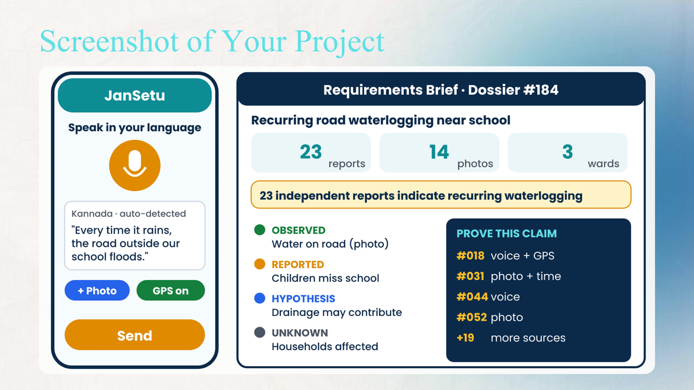

# Docs

This folder holds the project diagrams and UI mockups exported from the submission deck.

### Tech Stack & Architecture (`architecture.png`)

### Flowchart (`flowchart.png`)

### Data Flow Diagram (`dfd.png`)

### UI Mockup (`ui-mockup.png`)

Mermaid versions of the flowchart and architecture are also in the main [README](../README.md).
