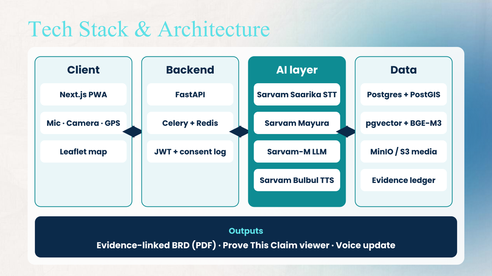
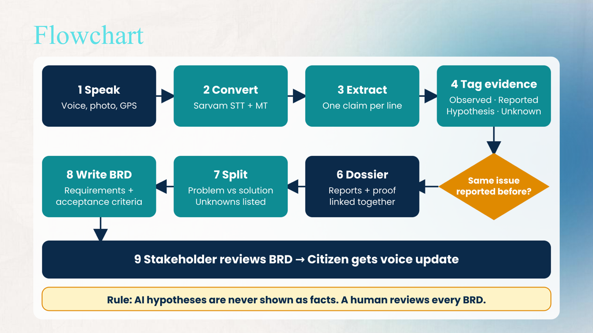
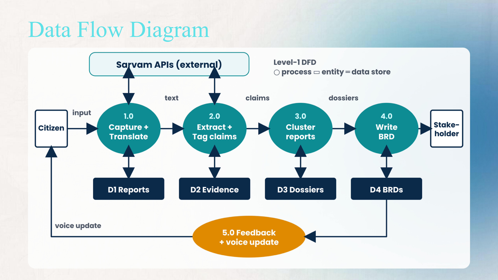
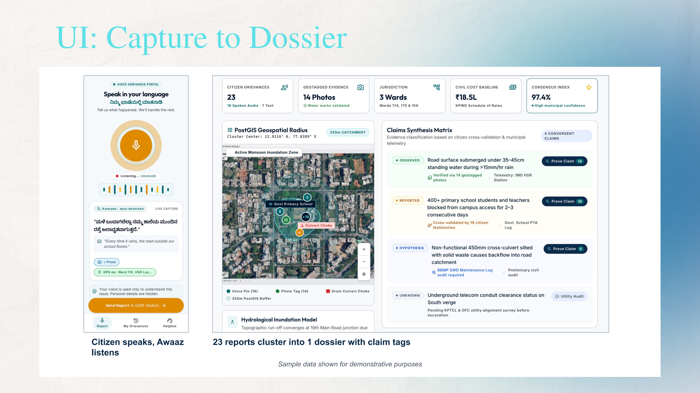
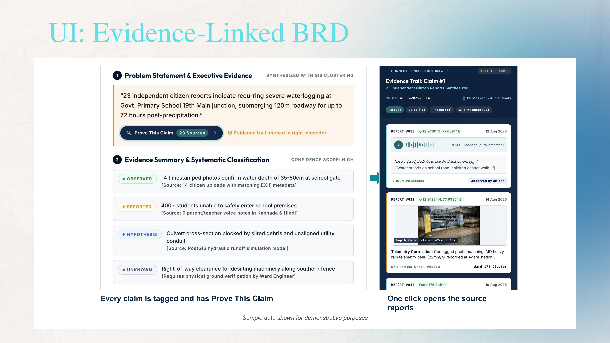

# Docs

This folder holds the project diagrams and UI mockups exported from the submission deck.

### Tech Stack & Architecture (`architecture.png`)

### Flowchart (`flowchart.png`)

### Data Flow Diagram (`dfd.png`)

### UI: Capture to Dossier (`ui-capture-to-dossier.jpg`)

### UI: Evidence-Linked BRD (`ui-evidence-linked-brd.jpg`)

Mermaid versions of the flowchart and architecture are also in the main [README](../README.md).
